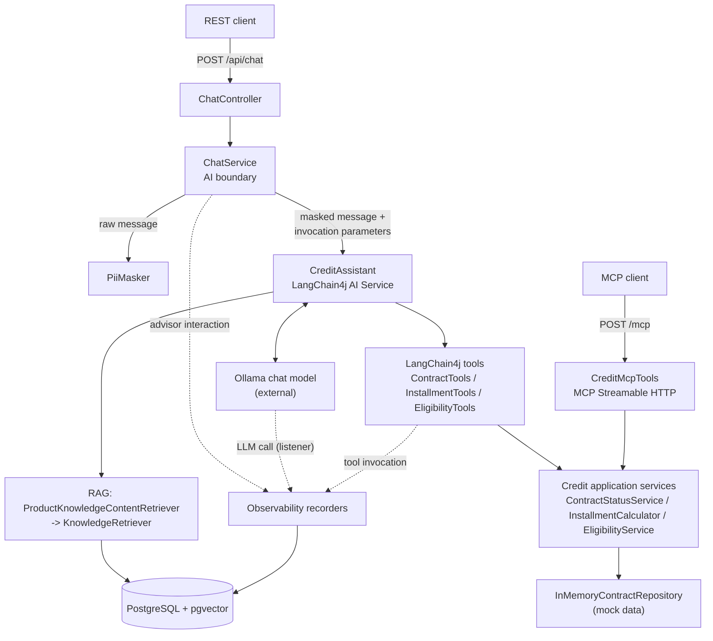

# Credit Assistant

An AI assistant MVP for consumer-credit advisors, built with Java 25, Spring Boot and LangChain4j.

An advisor asks a question in natural language. A local LLM (Ollama, `qwen3:8b` by default) interprets it and decides
whether it needs product documentation, a deterministic credit capability, or both. The LLM does not produce business
facts itself:

- contract data, installment calculations and eligibility decisions come from deterministic Java services,
- product rules come from bundled product documentation retrieved through RAG (PostgreSQL + pgvector),
- supported personal data is masked before anything reaches the LLM, and only masked content is persisted,
- the same credit capabilities are available to the assistant as LangChain4j tools and to external AI clients through
  an MCP server,
- every advisor request, LLM call and tool execution is recorded and correlated,
- answer quality is checked by an automated evaluation suite against the real model.

This is an engineering MVP and portfolio project with mock data, not a production banking system.

For a detailed walkthrough of how a request travels through the code, see [docs/how-it-works.md](docs/how-it-works.md).
The full requirements record is [SPEC.md](SPEC.md).

## Architecture



The dotted edges are observability records. All persisted content is masked.

## Request flow

1. `ChatController` receives `POST /api/chat` and hands the raw message to `ChatService`.
2. `ChatService` masks the message with `PiiMasker`. This step fails closed: if masking fails, the model is never called,
   the interaction is stored as `REJECTED_PRIVACY` without the message, and the request fails with a sanitized error.
3. The advisor interaction is persisted as started, with the masked message only.
4. `CreditAssistant` is called with the masked text. Protected original values (currently contract numbers) and the
   interaction ID travel in LangChain4j `InvocationParameters`, which are not sent to the model.
5. Before the model call, RAG retrieves relevant product documentation for the masked question and adds it to the user
   message.
6. The model answers directly or requests tools. A tool resolves placeholders such as `[CONTRACT_NUMBER_1]` to the
   original value inside Java, calls the credit service, and returns a result that still refers to the placeholder.
7. The final answer is returned to the advisor unchanged. A separately masked copy is stored for observability. If that
   defensive masking fails, the response is left out of the stored record, and the request still succeeds.
8. If the model call fails, the interaction is stored as `FAILED` and the original exception is rethrown.

## Deterministic tools

The LLM decides when a capability is needed. Java computes and returns the authoritative result.

| Tool | Application service | Result |
|---|---|---|
| `getContractStatus` | `ContractStatusService` | status, outstanding principal, next payment date |
| `calculateInstallment` | `InstallmentCalculator` | monthly installment and total repayment (equal monthly installments) |
| `checkEligibility` | `EligibilityService` | `ELIGIBLE` / `NOT_ELIGIBLE`, reason code, explanation |

The LangChain4j tools (`chat.infrastructure`) and the MCP tools (`mcp.infrastructure`) are thin adapters. Both delegate to
the same services in the `credit` module, which contain all business rules and have no dependency on AI frameworks.
ArchUnit tests enforce this.

The mock data covers four contracts (`CTR-1001` to `CTR-1004`: active, paid off, overdue, cancelled). Eligibility uses a
small explicit rule set: minimum income, maximum obligations-to-income ratio, and maximum loan amount relative to
disposable income.

## RAG

- **Source:** three bundled mock Markdown documents in `src/main/resources/knowledge` (early repayment, loan
  regulations, FAQ).
- **Ingestion:** on startup (`KNOWLEDGE_INGESTION_ENABLED=true`). Text is normalized, split recursively into chunks of up
  to 400 characters, embedded, and stored in the `product_knowledge_embedding` table. Re-ingesting a document replaces
  its previous chunks.
- **Embeddings:** the in-process `all-MiniLM-L6-v2` (quantized) model. The chat model is not used for embeddings.
- **Retrieval:** every chat request retrieves up to 3 chunks with a minimum relevance score of 0.7, using the masked
  question. The chunks are added to the user message as labeled product documentation.

RAG is the source for product rules only. Contract facts, calculations and eligibility decisions always come from tools.
The system prompt tells the model to say so when the documentation does not contain an answer.

## Privacy / PII handling

The project masks two categories of PII:

- **PESEL:** any standalone 11-digit number becomes `[PESEL_n]`. This masking is one-way; the original is discarded.
- **Contract number:** `CTR-<digits>` or `CR-<yyyy>-<6 digits>` (case-insensitive) becomes `[CONTRACT_NUMBER_n]`. The
  original is kept in `ProtectedValues` so that `getContractStatus` can resolve it inside Java.

Masking is deterministic (regex, no LLM). The model, RAG retrieval and all persisted observability content only ever see
masked text. `ProtectedValues` never leaves the application boundary and never prints its values. Logs contain
interaction IDs, statuses, detected categories and exception types, but no message content.

This is an MVP privacy layer for the categories listed above. It is not a general data-loss-prevention solution.

## MCP

The application runs an MCP server (official MCP Java SDK, Streamable HTTP transport) on the same HTTP port as the REST
API, at `/mcp` by default. It exposes `getContractStatus`, `calculateInstallment` and `checkEligibility` with JSON input
and output schemas and structured results.

MCP clients call the credit services directly, without an LLM, so they pass real contract numbers. These calls do not go
through the chat PII boundary and are not recorded in the observability tables.

`Host` and `Origin` headers are validated against allow-lists as DNS-rebinding protection. The defaults allow
localhost only. The MCP server has no authentication; that is outside this local MVP.

## Observability

Records are stored in PostgreSQL (Flyway migration `V1__create_ai_interaction.sql`):

| Record | Table | Represents |
|---|---|---|
| `AdvisorInteraction` | `advisor_interaction` | one `POST /api/chat`: masked message, masked final response, status (`SUCCESS`, `FAILED`, `REJECTED_PRIVACY`), duration |
| `AiInteraction` | `ai_interaction` | one physical LLM call: model, masked prompt/response, input/output tokens, estimated cost, duration, requested tool names, error type |
| `ToolInvocation` | `tool_invocation` | one actual tool execution: tool name, status, duration |

LLM calls and tool invocations both reference their advisor interaction. A request that uses a tool usually produces
two LLM calls: one requesting the tool and one producing the answer.

Tokens and cost are `NULL` when the provider does not report usage. Cost is estimated from configurable prices per
million tokens, and defaults to 0 for local Ollama. Tool arguments, tool results and error messages are never stored. A
failure to write any of these records is logged and never fails the advisor request. There is no distributed tracing
or dashboard in this project.

## Evaluation

`CreditAssistantEvaluationTest` runs a dataset of 10 synthetic cases
(`src/test/resources/evaluation/credit-assistant-evaluation.json`). It uses the real application, the real configured
Ollama model, real RAG on Testcontainers pgvector, and the real tools. Categories:

- FAQ retrieval
- Semantic early-repayment retrieval
- Contract status tool
- Installment calculation tool
- Eligible customer
- Ineligible customer
- Combined RAG + tool
- PII masking
- Unsupported future information
- Missing product knowledge

Each case can assert:

- required facts, required concepts and forbidden concepts in the answer (tolerant matching),
- the documents returned by retrieval,
- which tools actually ran, from the `tool_invocation` records,
- the number of LLM calls and their correlation with the advisor interaction,
- that no raw PII appears in any persisted content, and that the expected placeholders do.

There is no LLM-as-a-judge. The run prints a summary with pass/fail/error counts, model, LLM calls, tokens, estimated
cost and duration. Because it needs Ollama and takes a while, it is excluded from the normal build.

## Tech stack

- Java 25, Maven
- Spring Boot 4.1.1 (Web MVC, JDBC, Validation, Flyway)
- LangChain4j 1.20.0-beta30: AI Services, Ollama, pgvector, in-process `all-MiniLM-L6-v2` embeddings
- Ollama, default model `qwen3:8b`
- PostgreSQL 17 with pgvector (`pgvector/pgvector:pg17`)
- MCP Java SDK 2.0.1
- JUnit Jupiter 6, AssertJ, Testcontainers 2, ArchUnit
- Docker, Docker Compose

## Prerequisites

- JDK 25 and Maven (for running and testing on the host)
- Docker with Compose v2
- [Ollama](https://ollama.com) with the model pulled:

  ```bash
  ollama pull qwen3:8b
  ```

## Running locally

### Option A: application from IntelliJ or Maven

Start only the database:

```bash
docker compose up -d postgres
```

Make sure Ollama is running, then start the application:

```bash
mvn spring-boot:run
```

Or run `CreditAssistantApplication` from IntelliJ. The defaults from `application.yaml` are used:

| | |
|---|---|
| Application | `http://localhost:8080` |
| PostgreSQL | `localhost:5432`, database/user/password `credit_assistant` |
| Ollama | `http://localhost:11434`, model `qwen3:8b` |

### Option B: complete Docker Compose stack

```bash
docker compose up --build -d
docker compose ps
docker compose logs app
```

This builds the application image from the multi-stage `Dockerfile` and starts `postgres` and `app`. `app` starts only
after `postgres` passes its healthcheck.

| | Host | Inside Compose |
|---|---|---|
| Application | `localhost:${APP_PORT:-8080}` | port 8080 |
| PostgreSQL | `localhost:${DB_PORT:-5432}` | `postgres:5432` |

Ollama is not part of Compose. The container reaches it at `http://host.docker.internal:11434` by default. Compose maps
this name to the host through `host-gateway`, so it also works on Linux, where Ollama must listen on an interface
reachable from Docker containers (for example `OLLAMA_HOST=0.0.0.0`), not only on loopback.

Compose passes these host environment variables through:

- `DB_NAME`, `DB_USERNAME`, `DB_PASSWORD`: shared by both services
- `DB_PORT`, `APP_PORT`: host-side published ports
- `OLLAMA_BASE_URL`, `OLLAMA_MODEL`, `OLLAMA_TIMEOUT`

For example:

```bash
OLLAMA_MODEL=qwen3:14b docker compose up --build -d
```

Stop the stack with `docker compose down`. The database volume `postgres-data` is kept. Adding `-v` would delete it.

## Configuration

All settings are in `src/main/resources/application.yaml` and can be overridden with environment variables. The Compose
`app` service sets or forwards only the database and Ollama variables listed in Option B. The others need to be added
to its `environment` section if you want to change them there.

| Variable | Default | Purpose |
|---|---|---|
| `DB_HOST` | `localhost` | PostgreSQL host (`postgres` in Compose) |
| `DB_PORT` | `5432` | PostgreSQL port |
| `DB_NAME` | `credit_assistant` | database name |
| `DB_USERNAME` | `credit_assistant` | database user |
| `DB_PASSWORD` | `credit_assistant` | database password (local development only) |
| `OLLAMA_BASE_URL` | `http://localhost:11434` | Ollama endpoint (`http://host.docker.internal:11434` in Compose) |
| `OLLAMA_MODEL` | `qwen3:8b` | chat model |
| `OLLAMA_TIMEOUT` | `PT3M` | chat model timeout (ISO-8601 duration) |
| `KNOWLEDGE_INGESTION_ENABLED` | `true` | ingest the bundled product documents on startup |
| `MCP_ENDPOINT` | `/mcp` | MCP endpoint path |
| `MCP_ALLOWED_HOSTS` | `localhost:*,127.0.0.1:*` | allowed `Host` headers for MCP |
| `MCP_ALLOWED_ORIGINS` | `http://localhost:*,http://127.0.0.1:*` | allowed `Origin` headers for MCP |
| `LLM_INPUT_COST_PER_MILLION_TOKENS` | `0` | price used for cost estimation |
| `LLM_OUTPUT_COST_PER_MILLION_TOKENS` | `0` | price used for cost estimation |

## REST API

`POST /api/chat`

```bash
curl -X POST http://localhost:8080/api/chat \
  -H "Content-Type: application/json" \
  -d '{"message": "Can a customer repay a consumer loan early?"}'
```

Response:

```json
{
  "answer": "..."
}
```

The answer is generated by the model, so its wording varies. With a local model, a response can take tens of seconds.
A blank `message` is rejected with HTTP 400. There is no custom error model: privacy rejections and model failures
return a generic server error.

Example questions:

- `What is the status of contract CTR-1001?` (contract tool, masked contract number)
- `Calculate the monthly installment for 20000 at 8.5% annual interest over 24 months.` (installment tool)
- `Is a customer with 6000 monthly income and 1000 obligations eligible for a 40000 loan?` (eligibility tool)

## MCP endpoint

`http://localhost:8080/mcp` (Streamable HTTP). Connect an MCP client, or send an `initialize` request:

```bash
curl -X POST http://localhost:8080/mcp \
  -H "Content-Type: application/json" \
  -H "Accept: application/json, text/event-stream" \
  -d '{"jsonrpc":"2.0","id":1,"method":"initialize","params":{"protocolVersion":"2025-06-18","capabilities":{},"clientInfo":{"name":"curl","version":"1"}}}'
```

## Tests

```bash
mvn clean test
```

This runs unit tests, ArchUnit rules and Spring integration tests. The integration tests use Testcontainers PostgreSQL
with pgvector, so Docker must be running. No LLM is needed: the real-model evaluation is excluded by its JUnit tag
`ai-evaluation`.

## AI evaluation suite

```bash
mvn -Pai-evaluation test
```

This runs only `CreditAssistantEvaluationTest`. It needs Docker and the configured Ollama model. It stops with a setup
error if the model is not available, and fails the build if any case fails or errors. The duration depends on your
hardware and model.

## Project structure

Base package `pl.dch.creditassistant`. Modules are split into `api` / `application` / `domain` / `infrastructure`
packages:

| Package | Responsibility |
|---|---|
| `chat` | REST endpoint, `ChatService` (AI boundary), `CreditAssistant` AI Service, LangChain4j tools, RAG wiring, LLM call listener |
| `credit` | deterministic contract, installment and eligibility services and domain; no AI or persistence frameworks |
| `knowledge` | product document ingestion and semantic retrieval (pgvector) |
| `privacy` | `PiiMasker`, placeholders and `ProtectedValues` |
| `mcp` | MCP server configuration and tool adapters |
| `observability` | advisor interaction, LLM call and tool invocation records, cost estimation, JDBC persistence |

Tests mirror these packages. The evaluation suite is in `src/test/java/.../evaluation`.

## Design principles

1. Business logic is deterministic Java outside the LLM; the model chooses tools and phrases the answer.
2. The `credit` domain does not depend on LangChain4j, MCP or persistence frameworks (ArchUnit-enforced).
3. LangChain4j tools and MCP tools are adapters over the same application services.
4. PII is masked at the AI boundary; original values stay inside trusted Java code.
5. RAG is only for product knowledge, never for contract data or calculations.
6. Observability correlates each advisor request with its LLM calls and tool executions, using masked content only.
7. Frameworks and infrastructure (vector store, JDBC, model provider) stay behind application interfaces.
8. AI quality is checked with automated, measurable assertions rather than manual review.

## LangChain4j concepts and Spring AI equivalents

The project uses LangChain4j. For readers who know Spring AI, the closest equivalents are:

| Used here (LangChain4j) | Spring AI equivalent |
|---|---|
| `@AiService` interface (`CreditAssistant`) | `ChatClient` |
| `@Tool` methods | `@Tool` methods |
| `InvocationParameters` (hidden tool context) | `ToolContext` |
| `RetrievalAugmentor` / `ContentRetriever` | `RetrievalAugmentationAdvisor` / `DocumentRetriever` |
| `EmbeddingStore` (`PgVectorEmbeddingStore`) | `VectorStore` (`PgVectorStore`) |
| `EmbeddingModel` | `EmbeddingModel` |
| `DocumentSplitter` | `TextSplitter` |
| `ChatModelListener` | Micrometer observations of `ChatModel` |

## Current limitations

- Contract data is an in-memory mock with four contracts. Eligibility rules are a simple illustrative policy.
- Product knowledge is three bundled mock documents ingested at startup.
- Ollama is the only configured chat model provider.
- PII masking covers PESEL and contract numbers only.
- The REST API and MCP server have no authentication or authorization.
- Responses are not streamed. There is no conversation memory between requests, and no frontend.
- Docker Compose is a local development setup, not production deployment infrastructure.
